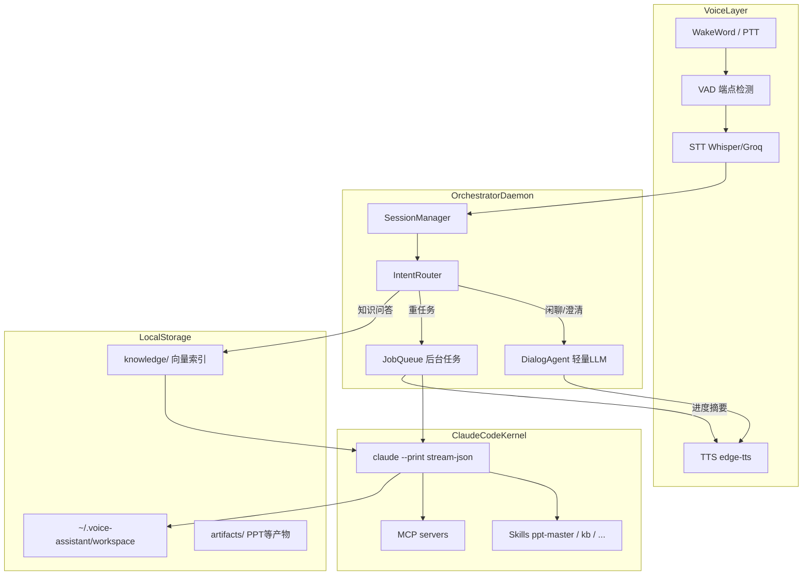
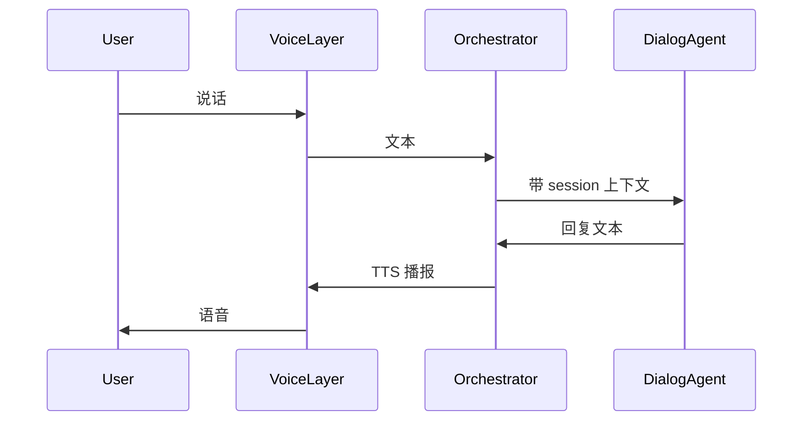
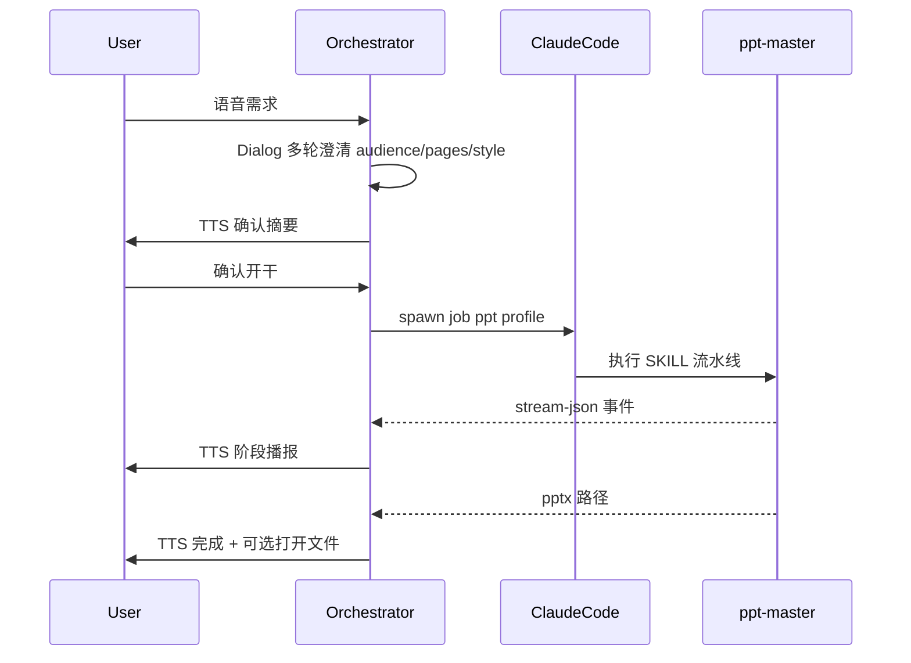
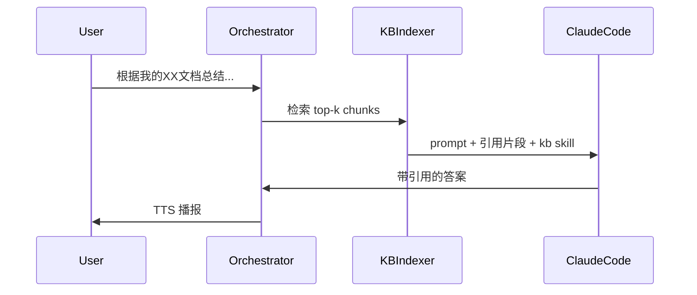
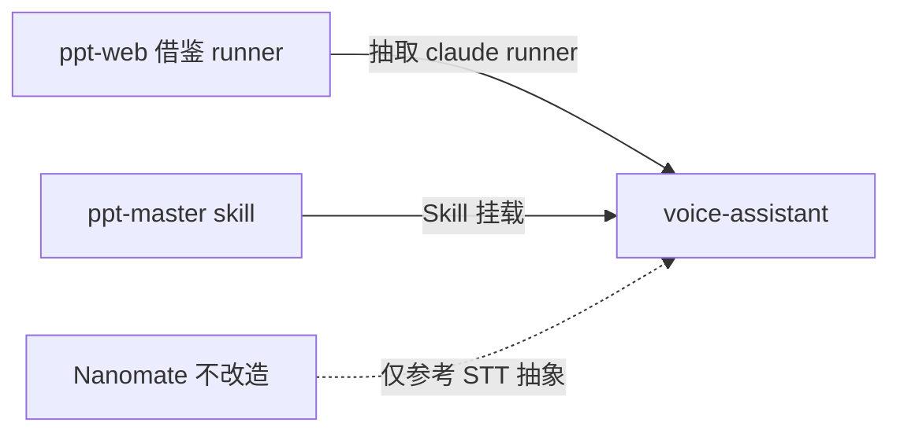

# Butler Desktop — 个人语音桌面助手

> 设计文档 · 2026-06-25  
> 状态：**设计阶段，尚未开始编码**

## 产品定位

**一句话**：说「小助，帮我做一份 PPT」→ 语音澄清需求 → Claude Code 在本地开干 → 语音播报进度与结果。

个人桌面助手，以**语音唤醒 + 语音对话**为主要交互方式，内核基于 **Claude Code**，配合 ppt-master、知识库等 Skill 插件，逐步覆盖日常办公场景。

### 已确认的技术路线

| 决策项 | 选择 |
|--------|------|
| 架构 | 新建「语音编排器 + Claude Code CLI」，不改造 Nanomate |
| MVP 范围 | 语音对话 + 做 PPT + 个人知识库问答 |
| 平台 | macOS 优先（后续可扩展） |

### 可复用的现有资产

| 资产 | 路径 | 复用方式 |
|------|------|----------|
| Claude Code headless 执行模式 | `~/Developer/personal/ppt-web/backend/runner/` | 抽取 `stream_claude` + `stream-json` 解析 |
| ppt-master 工作流 | `~/.claude/plugins/cache/ppt-master/...` | 作为 Claude Code Skill 挂载 |
| 浏览器自动化 | `~/.agents/skills/autoglm-browser-agent` | Phase 2+ 插件，MVP 不纳入 |
| Nanomate STT 思路 | `~/Developer/personal/Nanomate/nanobot/audio/` | 借鉴 provider 抽象，不 fork agent loop |

---

## 总体架构



### 设计原则

1. **双环模型**：对话环（秒级、可打断）+ 执行环（分钟级、Claude Code 子进程）
2. **Claude Code 只做执行**：意图澄清、进度口语化由编排器的轻量对话模型负责
3. **Skill 即插件**：PPT、知识库、未来邮件/表格都注册为 Skill + Job Profile
4. **本地优先**：知识库与产物在 `~/.voice-assistant/`；API 密钥仅用于 LLM/STT

---

## MVP 场景

### 场景 A：语音闲聊 / 需求澄清



- 不启动 Claude Code，延迟目标 **< 3s**（STT + 短回复 + TTS）
- Session 保存：最近 N 轮对话 + 进行中的任务状态

### 场景 B：「帮我做 PPT」（重任务）



**关键实现**（借鉴 ppt-web）：

- 调用形态：`claude -p "<prompt>" --output-format stream-json --dangerously-skip-permissions`
- 工作目录：`~/.voice-assistant/workspace/jobs/<job_id>/`
- ppt-master Eight Confirmations：MVP 默认**语音确认后自动 resume**（类似 ppt-web 的 `AUTO_CONFIRM_TEXT`）
- 进度映射：stream-json 事件 → 5~8 个用户可理解阶段（解析素材 → 定大纲 → 生成页面 → 导出 PPTX）

### 场景 C：知识库问答



**知识库 MVP 方案**：

- 源文件目录：`~/.voice-assistant/knowledge/`（md/pdf/docx，复用 ppt-master 的 `source_to_md` 做 ingest）
- 索引：`sqlite-vec` 或 `chromadb` 本地向量库
- Claude Code 侧：新增 `knowledge-base/SKILL.md`，或通过 MCP `search_knowledge` 工具暴露检索

---

## 项目结构（规划）

```
voice-assistant/
├── README.md                    # 本设计文档
├── pyproject.toml               # Phase 0
├── config.example.yaml          # STT/TTS/wake/Claude 配置
├── daemon/
│   ├── main.py                  # 常驻进程入口
│   ├── session.py               # 多轮会话 + 任务状态机
│   ├── router.py                # 意图路由：chat | ppt_job | kb_query
│   └── dialog.py                # 轻量对话（澄清/摘要/进度口语化）
├── voice/
│   ├── capture.py               # 麦克风 + VAD
│   ├── stt.py                   # faster-whisper 或 Groq API
│   ├── tts.py                   # edge-tts
│   └── wake.py                  # Phase 1.5：openWakeWord；MVP 先用 PTT
├── claude/
│   ├── runner.py                # 从 ppt-web 抽取 stream_claude
│   ├── events.py                # stream-json → 统一 JobEvent
│   └── profiles/                # job 配置：ppt.yaml, kb.yaml
├── plugins/
│   ├── registry.py
│   ├── ppt.py                   # ppt-master 路径、prompt 模板
│   └── knowledge.py             # ingest + search + skill 路径
├── kb/
│   ├── indexer.py
│   └── store/                   # sqlite-vec 数据文件
└── ui/
    └── menubar/                 # macOS 菜单栏状态
```

### Claude Code 集成配置

- 全局 Skills：`~/.claude/skills/` 软链 ppt-master、knowledge-base
- 项目级 `CLAUDE.md`：助手行为（中文回复、办公场景、产物路径约定）
- MCP（后续）：filesystem、calendar、邮件 — MVP 不必须

### 本地数据目录

```
~/.voice-assistant/
├── config.yaml
├── workspace/jobs/<job_id>/     # Claude Code 工作区
├── knowledge/                   # 原始文档
├── kb/store/                    # 向量索引
└── artifacts/                   # PPT 等产物
```

---

## 语音交互设计

| 能力 | MVP | 后续 |
|------|-----|------|
| 输入 | **按住说话 PTT** 或短唤醒词后 VAD 自动停 | 自定义唤醒词「小助」 |
| STT | Groq Whisper API 或 faster-whisper 本地 | 端侧模型 |
| TTS | edge-tts 中文神经音 | 克隆音色 |
| 打断 | 执行中可说「停」取消 Claude 子进程 | 全双工 |
| 反馈 | 短 beep + 「我在听」/ 「正在做 PPT，已完成 3/10 页」 | 悬浮窗进度 |

### 对话状态机

```
Idle → Listening → Transcribing → Routing
  ├─ Chat → Speaking → Idle
  ├─ Clarifying(ppt) → Speaking → WaitingConfirm → JobRunning → Speaking → Idle
  └─ KBQuery → JobRunning(short) → Speaking → Idle
```

### PPT 澄清必问项

语音一次问 1~2 个，避免信息轰炸：

1. 主题与受众
2. 页数 / 时长
3. 有无参考材料
4. 风格偏好（商务 / 科技 / 品牌色）
5. 最终确认摘要后开干

---

## 与现有项目的关系



- **不改造 Nanomate**：其 agent loop 与 Claude Code 内核目标不一致
- **不合并 ppt-web**：ppt-web 是多租户 Web + Docker；个人助手应本机单用户、无 Docker 也可跑
- **共享 ppt-master**：保证语音触发与 Web 提交产物质量一致

---

## 分阶段交付计划

### Phase 0 — 骨架（约 1 周）

- 完善 `pyproject.toml`、`config.yaml`、日志与目录初始化
- 从 ppt-web 抽取 Claude CLI 流式封装
- CLI 验证：`assistant run "用 ppt-master 做一页封面"` 终端跑通

### Phase 1 — 语音闭环（约 1~2 周）

- PTT：按住 Option 键说话
- STT + TTS 管道
- DialogAgent：多轮澄清 + 简单闲聊
- 菜单栏图标：Idle / Listening / Working

### Phase 2 — PPT 插件（约 1~2 周）

- `plugins/ppt.py`：job profile、工作区、stream-json 阶段映射
- 语音确认 → 后台 Claude Code 执行 → TTS 进度播报
- 完成后 `open` PPT 或复制路径

### Phase 3 — 知识库（约 1~2 周）

- `knowledge/` 目录 ingest + 增量索引
- `knowledge-base/SKILL.md` + 检索 MCP 或内置 tool
- 语音：「把 Downloads 里刚下的报告加入知识库」

### Phase 4 — 唤醒词与体验（可选）

- openWakeWord 本地唤醒「小助」
- 全双工打断、执行中插队新指令
- LaunchAgent 开机自启

---

## 技术选型

| 组件 | 推荐 | 理由 |
|------|------|------|
| 语言 | Python 3.11+ | 与 ppt-web、ppt-master、Nanomate 生态一致 |
| Claude 调用 | `claude` CLI + stream-json | 已在 ppt-web 验证 |
| STT | Groq `whisper-large-v3` | 延迟低；本地 fallback 用 faster-whisper |
| TTS | edge-tts | 中文免费、ppt-master 已用 |
| VAD | silero-vad | 准确、轻量 |
| 向量库 | sqlite-vec | 零依赖，个人规模足够 |
| macOS UI | rumps 菜单栏 | MVP 足够；后续可换 Tauri |

---

## 风险与对策

| 风险 | 对策 |
|------|------|
| ppt-master 耗时长（10+ 分钟） | 执行环与对话环分离；TTS 仅播报里程碑 |
| Claude Code 权限弹窗 | headless 用 `--dangerously-skip-permissions`；敏感操作加语音二次确认 |
| 语音识别错误 | 澄清环节复述确认；PPT 开干前念摘要 |
| API 成本 | Dialog 用小模型；重任务才走 Claude Code |
| 「什么都能做」预期 | Router 明确支持列表；不支持的能力诚实告知 |

---

## MVP 成功标准

1. **语音**：PTT 说 3 轮话完成 PPT 需求澄清
2. **PPT**：确认后 15 分钟内产出可打开 `.pptx`
3. **知识库**：ingest 5 份文档后，语音提问能引用原文回答
4. **体验**：执行中有语音进度；可说「停」取消任务
5. **稳定**：daemon 崩溃可自动重启；Claude session 可 `--resume` 续跑

---

## 下一步

设计确认后，按 Phase 0 开始编码：

1. 完善项目骨架与配置
2. 从 ppt-web 抽取最小 `claude/runner.py`
3. 实现 Phase 1 PTT 语音环
4. 挂载 ppt-master，跑通第一个语音触发的 PPT job
